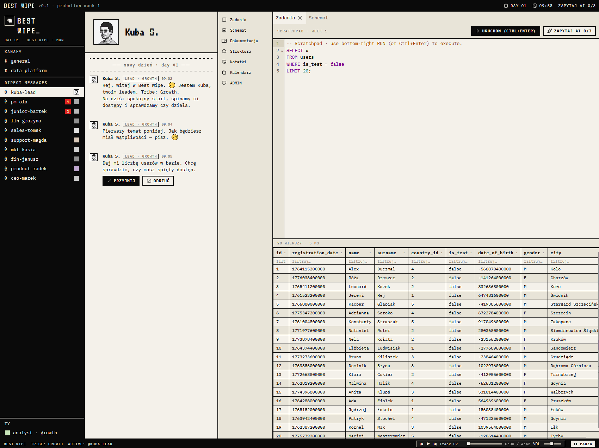

<div align="center">
  

  # Best Wipe

  **A corporate data-analyst survival game.**

  **[▶ Play in your browser](https://veatec22.github.io/best-wipe/)**
  <sub>· the hosted demo runs without the local AI — run locally for "Ask AI"</sub>
</div>

---

You are a junior data analyst on a 30-day probation at a fictional company.
Requests arrive through a Slack-like chat: vague, contradictory, political. You
write **real SQL** against a real in-browser database, decide what to accept,
what to quietly ignore, and what to push back on — then live with the
consequences. Nobody tells you whether your query was *right*. People just
react. Some of them lie. Some of them remember.

> The query runs. That doesn't mean it's correct.

## Screenshot

<div align="center">
  
</div>

## Features

- **Real SQL, real engine** — queries run against [DuckDB-WASM](https://duckdb.org/docs/api/wasm/overview)
  entirely in your browser, over a fictional company's sales / refunds /
  complaints / campaigns dataset.
- **Ambiguity over correctness** — `RUN` only tells you the SQL executed.
  Whether you delivered the *right* answer is revealed through NPC reactions,
  delayed follow-ups, and a Day 7 review.
- **Consequences that accumulate** — hidden facts, hidden scoring, trust and
  relationships shift as you `ACCEPT` / `REJECT` / `IGNORE` / `SEND`. Mid-week
  micro-consequences (changed replies, new reactions, vanished tasks, org-chart
  moves) build toward the review.
- **A moral spine** — a PM tries to bury a bad report; you choose between the
  truth and protecting them. The validator classifies what you actually sent.
- **Ask AI, locally** — an optional in-browser LLM ([WebLLM](https://github.com/mlc-ai/web-llm),
  WebGPU) gives limited, fallible assistance. No data leaves your machine.
- **The full office** — Slack-style channels, schema & docs panes, a tasks
  board, calendar/meetings, polls & reactions, avatar-compliance side stories,
  a chiptune player, and pixel-art everything.

## Tech stack

- **UI:** React 19, Zustand, [Dockview](https://dockview.dev/) panels, CodeMirror (SQL), Recharts, Mermaid
- **Data:** DuckDB-WASM (SQL engine), Dexie (IndexedDB persistence)
- **AI / audio:** WebLLM (local LLM via WebGPU), Howler, Web Speech
- **Desktop:** [Tauri 2](https://tauri.app/) (optional native build)
- **Tooling:** Vite, TypeScript, [Bun](https://bun.sh/), [Biome](https://biomejs.dev/), Playwright (E2E)

## Getting started

### Prerequisites

- [Bun](https://bun.sh/) `1.1.34+`
- A modern Chromium-based browser. The local **Ask AI** feature needs
  [WebGPU](https://caniuse.com/webgpu); without it, set `VITE_SKIP_AI=1`.
- For the desktop build only: the [Tauri 2 prerequisites](https://tauri.app/start/prerequisites/)
  (Rust toolchain + platform deps).

### Run in the browser

```bash
bun install
cp .env.example .env   # optional — sensible defaults work out of the box
bun run dev            # http://localhost:1420
```

### Run as a desktop app (Tauri)

```bash
bun run tauri:dev      # dev window
bun run tauri:build    # produce a native bundle
```

### Other scripts

```bash
bun run build              # type-check + production web build -> dist/
bun run lint               # Biome check
bun run typecheck          # tsc, no emit
bun run test:e2e:install   # one-time: install Playwright Chromium
bun run test:e2e           # run end-to-end tests
```

### Configuration

All knobs live in `.env` (see [`.env.example`](.env.example)). Notably
`MODE=player|admin`, `VITE_SKIP_AI=1` to disable the local LLM, and
`VITE_WEBLLM_MODEL_ID` to pick a different WebLLM model.

## Project layout

```
src/
  components/   UI panels (chat, data grid, SQL editor, tabs, …)
  game/         core loop, tasks, validation, scoring, campaign engine
  services/     DuckDB, AI providers, audio/SFX, avatars, persistence
  data/         seed people, channels, messages, schema
  ui/           design tokens + shared primitives
data/           fictional company CSV datasets
src-tauri/      desktop shell
e2e/            Playwright tests
```

## Credits

Background music is royalty-free; this is a non-commercial project.

## License

[MIT](LICENSE) © Veatec22
